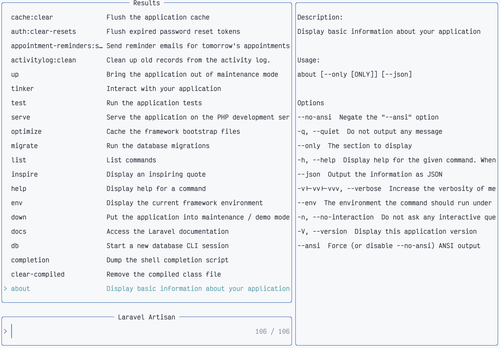

# Telescope artisan

An extension for [telescope.nvim](https://github.com/nvim-telescope/telescope.nvim) that allows you to search Laravel Artisan commands.



## Requirements

- [telescope.nvim](https://github.com/nvim-telescope/telescope.nvim) (required)
- Laravel project

## Setup

Install the plugin using your favorite package manager.

```lua
use({ 'jaytyrrell13/telescope-artisan.nvim' })
```

Then tell Telescope to load the extension:

```lua
require('telescope').setup({})
require('telescope').load_extension('artisan')
```

## Usage

```lua
require'telescope'.extensions.artisan.artisan{}
vim.cmd [[ Telescope artisan ]]
```

or

```vim
:Telescope artisan
```

## Default Mappings
| Mappings | Action            |
|:---------|:------------------|
| `<CR>`   | Prompt for additional arguments and then execute command |
| `<C-e>`  | Execute command in insert mode |
| `e`      | Execute command in normal mode |

